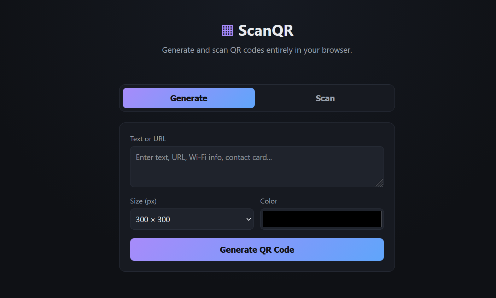

# ScanQR 📱

**QR Code Generator & Scanner** — a lightweight, no-backend web app to generate QR codes from text/URLs and scan QR codes via camera or uploaded image, entirely in the browser.

🔗 **Repository name:** `scanqr`

## Description

ScanQR lets you type any text, URL, or data string and instantly generate a downloadable QR code with customizable size and color — or switch to scan mode to read QR codes live via your webcam/phone camera, or by uploading an image. No backend, no data storage, no external server calls beyond loading the QR libraries.

## Features

- ✨ Generate QR codes from any text or URL
- 🎨 Customizable size (200–512px) and color
- 💾 Download generated QR code as PNG
- 📷 Live camera scanning (rear camera preferred on mobile)
- 🖼️ Scan QR codes from an uploaded image file
- 📋 One-click copy of scanned result
- 🌗 Clean dark-themed, responsive UI
- 🚫 No backend — works fully client-side

## Tech Stack

- HTML5 / CSS3 / Vanilla JavaScript
- [`qrcode`](https://github.com/soldair/node-qrcode) (QR generation via Canvas)
- [`html5-qrcode`](https://github.com/mebjas/html5-qrcode) (camera & image scanning)

## Getting Started

No installation or build step required.

```bash
git clone https://github.com/<your-username>/scanqr.git
cd scanqr
```

Open `index.html` directly in your browser, or serve it locally:

```bash
# Python
python -m http.server 8000

# Node
npx serve .
```

Visit `http://localhost:8000`.

> Note: camera scanning requires HTTPS (or `localhost`) due to browser security restrictions.

## Deploy on GitHub Pages

1. Push this repo to GitHub.
2. Go to **Settings → Pages**.
3. Under **Source**, select the `main` branch and `/ (root)` folder.
4. Your app will be live at `https://<your-username>.github.io/scanqr/` (HTTPS, so camera scanning works).

## Project Structure

```
scanqr/
├── index.html   # App layout, tabs for Generate/Scan
├── style.css    # Dark-themed responsive styling
├── script.js    # QR generation + camera/image scanning logic
└── README.md
```
# screenshot


## How It Works

- **Generate:** the `qrcode` library renders the QR matrix directly onto a `<canvas>`, styled with your chosen color/size, exportable as PNG via `canvas.toDataURL()`.
- **Scan:** `html5-qrcode` accesses the device camera via `getUserMedia` and decodes frames in real time, or decodes a QR pattern from a static uploaded image.

## License

MIT — free to use, modify, and distribute.

## Author

Built as part of an MCA coursework project.
